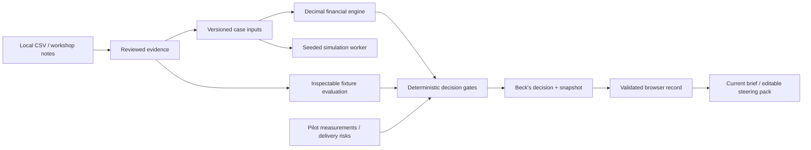
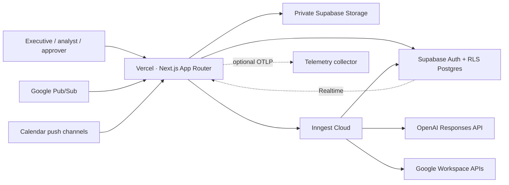
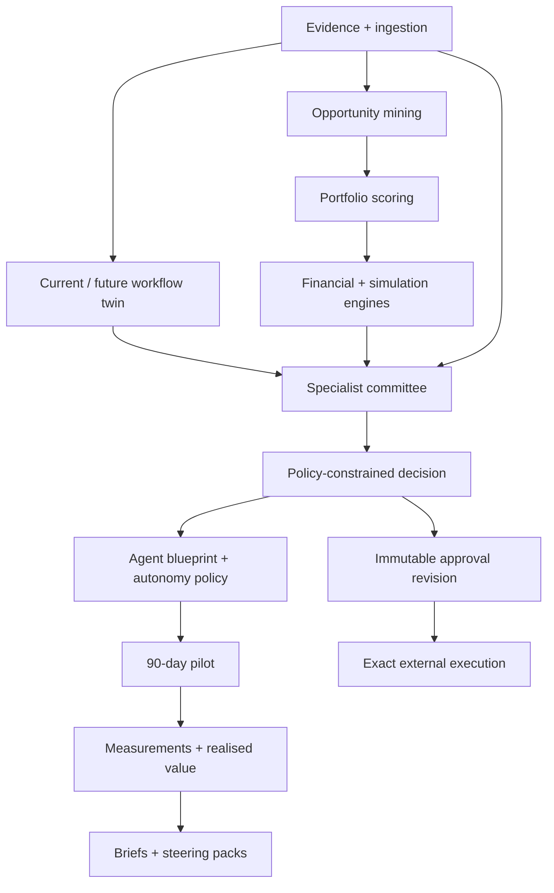
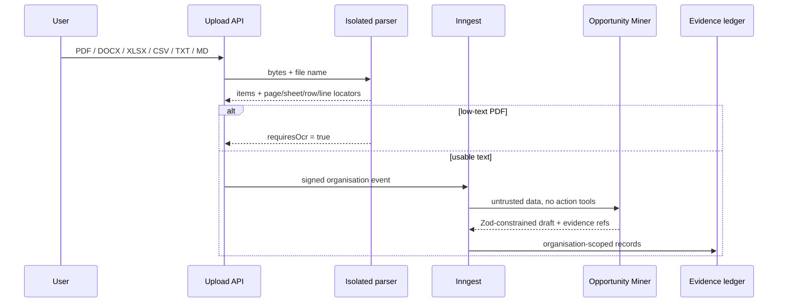
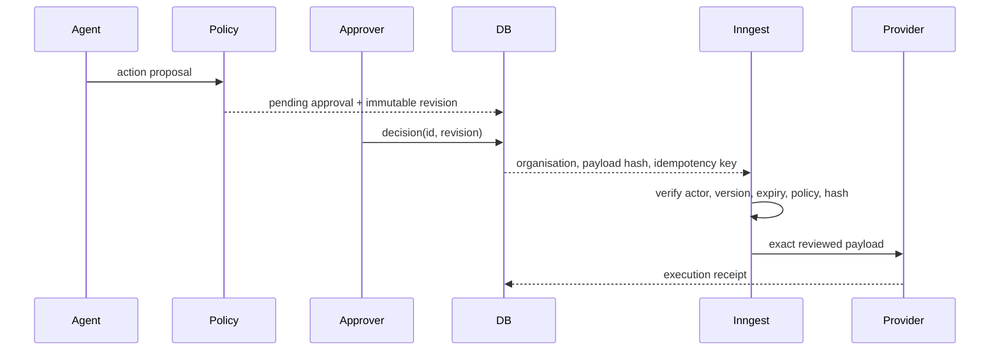

# Architecture

## Current interview release: two browser-local engagements

`/demo` renders `delivery-workbench/workbench.tsx` through a compatibility wrapper. Exactly two engagements are served: Support Operations Copilot and Executive Reporting Automation. Beck is the demonstration lead. Neither case represents a real client engagement or a Sia product.

The server only establishes the existing signed synthetic session. Source review, CSV parsing, calculation, fixture evaluation, delivery tracking, measurement and decisions run locally. The validated `beck-delivery-workbench:v1` browser record survives session renewal. It is not tenant storage and is not suitable for confidential material. Storage failures leave the previous record unchanged; corrupt records are preserved for backup and explicit recovery. Restore/reset affects only this key; legacy replay data is untouched.

Financial inputs have one deterministic Decimal.js path, including monthly ramp, investment, OPEX, economic and cash-only NPV. Sensitivity and scenarios call the same engine. A Web Worker runs 10,000 seeded triangular samples; displayed summaries are temporary and labeled by revision. Simulation is not a production background job. Fixture accuracy is calculated against inspectable expected labels, not presented as measured model quality. Hard gates prohibit scale without evidence, evaluation, positive economics, quality, adoption and human controls.

Decisions capture append-only snapshots of inputs, evidence and measurements. Subsequent changes retain the old snapshot and mark it stale. Local history is not tamper-proof: a browser owner can edit or restore it. Markdown and editable PowerPoint exports use the current project record, not the legacy Aster catalogue.

## Future production topology — not provisioned or accepted in this release

The platform is a modular monolith: one deployable Next.js application with strict domain boundaries and durable background execution. Postgres is the system of record; JSONB is limited to versioned schemas, immutable payload snapshots, structured model output, and connector metadata.

## Domain boundaries

Deterministic services own arithmetic, scoring, classifications, consensus, policy gates, scenario application, and value recommendations. Agents extract, interpret, challenge, redesign, and draft; they do not replace deterministic calculation or the human decision.

## Evidence ingestion

## Approval execution

Editing never mutates the reviewed payload; it creates a new approval revision. Gmail content approval creates a draft. Sending requires a new `gmail.send` approval.

## Tenant boundary

Browser reads and writes use session-bound Supabase clients. RLS evaluates membership and role for each tenant table and the first private-storage path segment. Integration secrets have no authenticated-client read policy. Background code may construct a service client only after a verified request, OAuth callback, or signed Inngest event provides an organisation context.

## Repository map

- `src/app`: routes and API boundaries.
- `src/modules`: domain logic, UI, agents, integrations, exports, and deterministic engines.
- `src/inngest`: durable functions.
- `src/config`: versioned model routing and cost configuration.
- `src/lib/domain`: stable public contracts.
- `supabase/migrations`: relational schema, RLS, storage policies, and immutability triggers.
- `supabase/tests`: pgTAP isolation checks.
- `tests/e2e`: executive, governance, responsive, and accessibility journeys.
