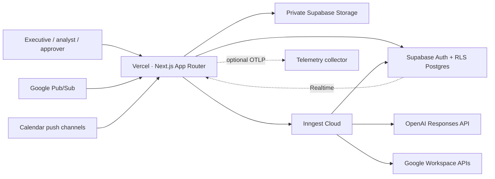
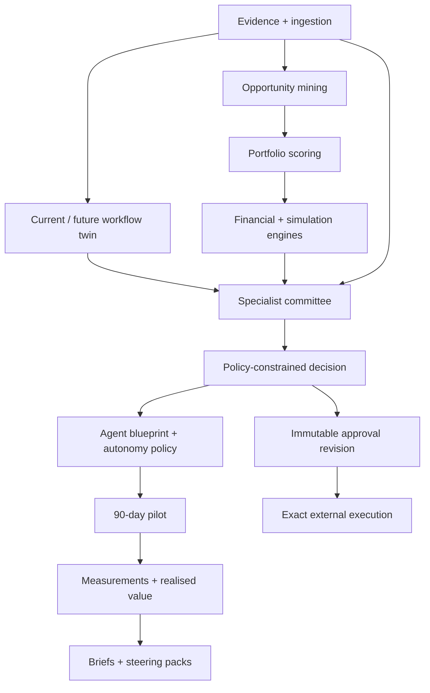
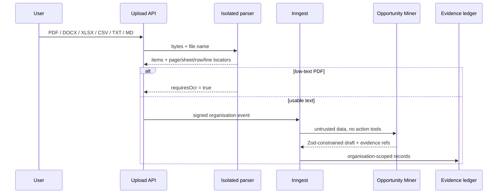
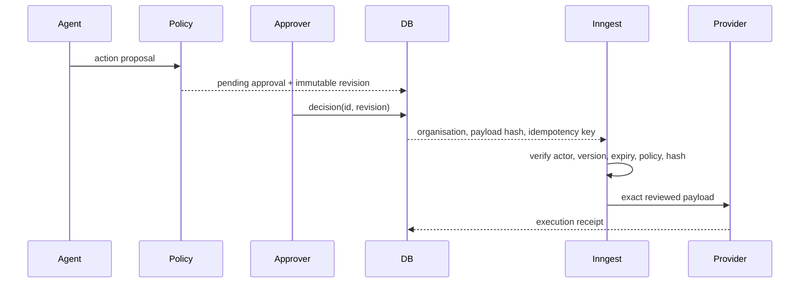

# Architecture

## Production topology

The platform is a modular monolith: one deployable Next.js application with strict domain boundaries and durable background execution. Postgres is the system of record; JSONB is limited to versioned schemas, immutable payload snapshots, structured model output, and connector metadata.

## Domain boundaries

Deterministic services own arithmetic, scoring, classifications, consensus, policy gates, scenario application, and value recommendations. Agents extract, interpret, challenge, redesign, and draft; they do not replace deterministic calculation or the human decision.

## Evidence ingestion

## Approval execution

Editing never mutates the reviewed payload; it creates a new approval revision. Gmail content approval creates a draft. Sending requires a new `gmail.send` approval.

## Tenant boundary

Browser reads and writes use session-bound Supabase clients. RLS evaluates membership and role for each tenant table and the first private-storage path segment. Integration secrets have no authenticated-client read policy. Background code may construct a service client only after a verified request, OAuth callback, or signed Inngest event provides an organisation context.

## Repository map

- `src/app`: routes and API boundaries.
- `src/modules`: domain logic, UI, agents, integrations, exports, and deterministic engines.
- `src/inngest`: durable functions.
- `src/config`: versioned model routing and cost configuration.
- `src/lib/domain`: stable public contracts.
- `supabase/migrations`: relational schema, RLS, storage policies, and immutability triggers.
- `supabase/tests`: pgTAP isolation checks.
- `tests/e2e`: executive, governance, responsive, and accessibility journeys.
