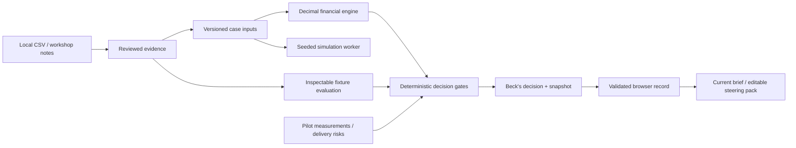
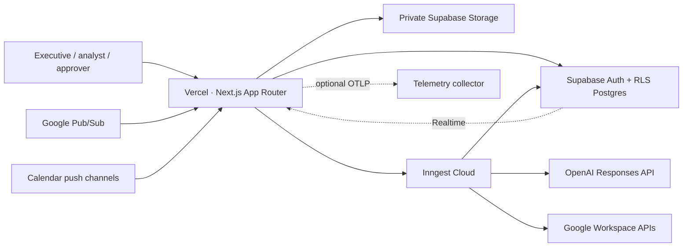
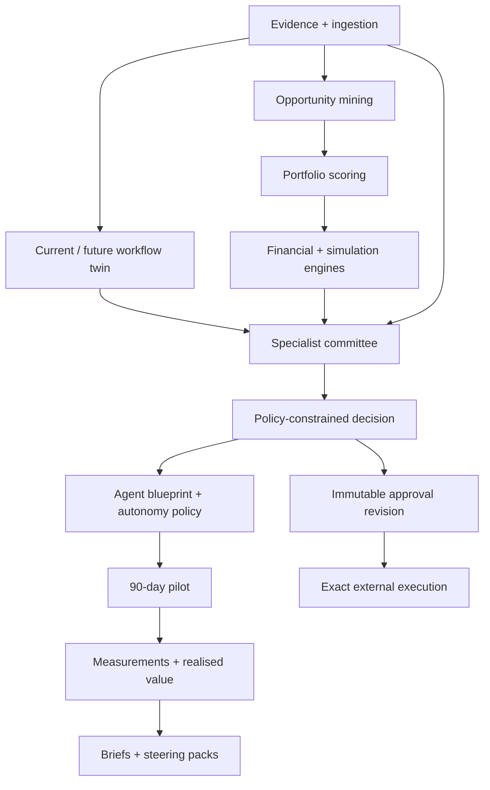
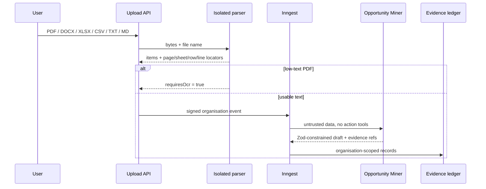
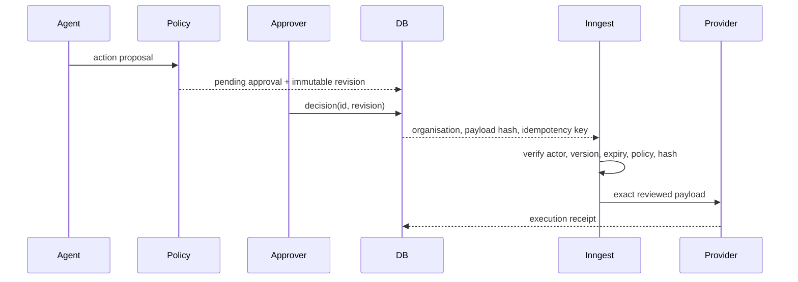

# Architecture

## Consulting assessment workspace

`/workbench` is intentionally public and renders `src/modules/assessment/workbench.tsx` as a browser-local, synthetic-only client workspace, bypassing legacy authentication and provider context. Its five sections are Brief, Evidence, Options & Value, Recommendation and Deliverables. It does not reuse or overwrite the `/demo` record, which has a separate signed synthetic entry. The assessment workspace provides no hosted storage or confidentiality guarantee.

Version 2 schemas validate engagements, opportunities, source reviews, assumptions, alternatives, scenarios, simulations and recommendation snapshots. `repository.ts` stores the workspace in IndexedDB (`beck-assessment-workbench`, `workspace`, `active`) with atomic optimistic revision checks. A save is successful only after transaction completion. Full JSON backups include internal notes and historical/legacy data. Restore previews validation before explicit replacement, while stale/unsupported/corrupt data is preserved with recovery guidance. Optional legacy migration copies supported records into version 2; original demo data remains intact and missing inputs remain unknown. No automatic schema upgrade rewrites unknown versions.

`economics.ts` is the single calculation engine: all alternatives are independently incremental to the captured BAU, over months 0–36. It separates annual capacity from cash subsets, first-year ROI from 36-month NPV, sustained monthly payback and unknown values from zero. Decimal arithmetic and finite-result guards reject unusable values. What-if scenarios and seeded worker simulations remain separate from the saved base used by policy and recommendation snapshots. Evidence reviews link through versioned assumption provenance and never silently mutate input numbers.

`exports.ts` is the public facade over focused payload, brief, workbook and slide modules. `prepareExport(engagement, opportunityId, brand, options)` resolves a saved draft or exact recommendation snapshot. The typed selection boundary is in `ui/surface.ts`. Its allowlisted projection excludes raw histories, unknown legacy objects and nested internal notes unless explicitly opted in. That same prepared payload drives the actual preview and all three formats. Snapshot-contained facts/economics never mix with current data; only the current opportunity revision is added for staleness context. Workspace branding is an explicit current rendering input because historical snapshots do not capture branding.

ExcelJS and PptxGenJS load dynamically at export time in the browser. The workbook has Overview, Options, Assumptions, Evidence, Costs, Benefits, Monthly flows, Validation and Methods, with numeric cells, literal text and no formulas, macros or external references. Text beyond Excel's cell limit continues in visible rows. The editable wide steering pack has exactly eight slides with bounded text, native tables and a native cumulative-net chart for complete cases. Overflow references point to the full workbook. Incomplete economics are draft/Not assessed while reviewed recommendation history keeps its original outcome. Blob downloads never upload entered content; recovery backup and client deliverables are deliberately different contracts.

The frontend follows the existing warm workbench layout, accessible labels and responsive navigation. Export tests exercise real archive contents and ExcelJS roundtrips; browser journeys check saved versus unsaved values, downloads, snapshot selection, note exclusion, accessibility and no transmission of entered content. These checks do not imply native PowerPoint certification, a manual screen-reader audit or human practitioner validation. Follow the [existing practitioner protocol](assessment-practitioner-validation.md), currently **not conducted**, before making claims about assessment quality or time saved. The full application release gate is owned by final integration.

## Current interview release: two browser-local engagements

`/demo` renders `delivery-workbench/workbench.tsx` through a compatibility wrapper. Exactly two engagements are served: Support Operations Copilot and Executive Reporting Automation. Beck is the demonstration lead. Neither case represents a real client engagement or a Sia product.

The server only establishes the existing signed synthetic session. Source review, CSV parsing, calculation, fixture evaluation, delivery tracking, measurement and decisions run locally. The validated `beck-delivery-workbench:v1` browser record survives session renewal. It is not tenant storage and is not suitable for confidential material. Storage failures leave the previous record unchanged; corrupt records are preserved for backup and explicit recovery. Restore/reset affects only this key; legacy replay data is untouched.

Financial inputs have one deterministic Decimal.js path, including monthly ramp, investment, OPEX, economic and cash-only NPV. Sensitivity and scenarios call the same engine. A Web Worker runs 10,000 seeded triangular samples; displayed summaries are temporary and labeled by revision. Simulation is not a production background job. Fixture accuracy is calculated against inspectable expected labels, not presented as measured model quality. Hard gates prohibit scale without evidence, evaluation, positive economics, quality, adoption and human controls.

Decisions capture append-only snapshots of inputs, evidence and measurements. Subsequent changes retain the old snapshot and mark it stale. Local history is not tamper-proof: a browser owner can edit or restore it. Markdown and editable PowerPoint exports use the current project record, not the legacy Aster catalogue.

```mermaid
flowchart LR
  CSV[Local CSV / workshop notes] --> E[Reviewed evidence]
  E --> C[Versioned case inputs]
  C --> F[Decimal financial engine]
  C --> W[Seeded simulation worker]
  E --> V[Inspectable fixture evaluation]
  F --> G[Deterministic decision gates]
  V --> G
  P[Pilot measurements / delivery risks] --> G
  G --> D[Beck's decision + snapshot]
  D --> S[Validated browser record]
  S --> X[Current brief / editable steering pack]
```

## Future production topology — not provisioned or accepted in this release

The platform is a modular monolith: one deployable Next.js application with strict domain boundaries and durable background execution. Postgres is the system of record; JSONB is limited to versioned schemas, immutable payload snapshots, structured model output, and connector metadata.

```mermaid
flowchart LR
  U[Executive / analyst / approver] --> V[Vercel · Next.js App Router]
  V --> S[Supabase Auth + RLS Postgres]
  V --> B[Private Supabase Storage]
  V --> I[Inngest Cloud]
  I --> S
  I --> O[OpenAI Responses API]
  I --> G[Google Workspace APIs]
  GP[Google Pub/Sub] --> V
  GC[Calendar push channels] --> V
  S -. Realtime .-> V
  V -. optional OTLP .-> T[Telemetry collector]
```

## Domain boundaries

```mermaid
flowchart TB
  Evidence[Evidence + ingestion] --> Opportunity[Opportunity mining]
  Opportunity --> Portfolio[Portfolio scoring]
  Evidence --> Workflow[Current / future workflow twin]
  Portfolio --> Economics[Financial + simulation engines]
  Workflow --> Committee[Specialist committee]
  Economics --> Committee
  Evidence --> Committee
  Committee --> Decision[Policy-constrained decision]
  Decision --> Blueprint[Agent blueprint + autonomy policy]
  Blueprint --> Pilot[90-day pilot]
  Pilot --> Value[Measurements + realised value]
  Value --> Steering[Briefs + steering packs]
  Decision --> Approval[Immutable approval revision]
  Approval --> Connector[Exact external execution]
```

Deterministic services own arithmetic, scoring, classifications, consensus, policy gates, scenario application, and value recommendations. Agents extract, interpret, challenge, redesign, and draft; they do not replace deterministic calculation or the human decision.

## Evidence ingestion

```mermaid
sequenceDiagram
  participant User
  participant API as Upload API
  participant Parser as Isolated parser
  participant Job as Inngest
  participant Miner as Opportunity Miner
  participant DB as Evidence ledger
  User->>API: PDF / DOCX / XLSX / CSV / TXT / MD
  API->>Parser: bytes + file name
  Parser-->>API: items + page/sheet/row/line locators
  alt low-text PDF
    Parser-->>API: requiresOcr = true
  else usable text
    API->>Job: signed organisation event
    Job->>Miner: untrusted data, no action tools
    Miner-->>Job: Zod-constrained draft + evidence refs
    Job->>DB: organisation-scoped records
  end
```

## Approval execution

```mermaid
sequenceDiagram
  participant Agent
  participant Policy
  participant Approver
  participant DB
  participant Job as Inngest
  participant Provider
  Agent->>Policy: action proposal
  Policy-->>DB: pending approval + immutable revision
  Approver->>DB: decision(id, revision)
  DB-->>Job: organisation, payload hash, idempotency key
  Job->>Job: verify actor, version, expiry, policy, hash
  Job->>Provider: exact reviewed payload
  Provider-->>DB: execution receipt
```

Editing never mutates the reviewed payload; it creates a new approval revision. Gmail content approval creates a draft. Sending requires a new `gmail.send` approval.

## Tenant boundary

Browser reads and writes use session-bound Supabase clients. RLS evaluates membership and role for each tenant table and the first private-storage path segment. Integration secrets have no authenticated-client read policy. Background code may construct a service client only after a verified request, OAuth callback, or signed Inngest event provides an organisation context.

## Repository map

- `src/app`: routes and API boundaries.
- `src/modules`: domain logic, UI, agents, integrations, exports, and deterministic engines.
- `src/inngest`: durable functions.
- `src/config`: versioned model routing and cost configuration.
- `src/lib/domain`: stable public contracts.
- `supabase/migrations`: relational schema, RLS, storage policies, and immutability triggers.
- `supabase/tests`: pgTAP isolation checks.
- `tests/e2e`: executive, governance, responsive, and accessibility journeys.
